# Food For All
**by *Team 8* of [COM6103 Team Software Project](http://www.dcs.shef.ac.uk/intranet/teaching/public/modules/msc/com6103.html) in the University of Sheffield**

Please note that this repository was migrated from a private gitlab repository, so some of the commit history may not be continuous.

## Set up Guide

See in [Set Up Guide](./setup.md)

## Technique Stacks

### Front End

#### Technique Stack (Framework)

- React.js
- React Hook
- React Redux
- etc.

#### Dependencies & Library

##### Component Library

[Ant Design](https://ant.design/) by Alibaba

[Material UI](https://mui.com)

##### Utils

lodash

### Back End

#### Technique Routes

Framework: Django with Python 3.x

Database: Mysql

### Docs

[Front End Readme](web-app/README.md)

[Back End Readme](server-app/README.md)

## Demo

### Project

- Home Page
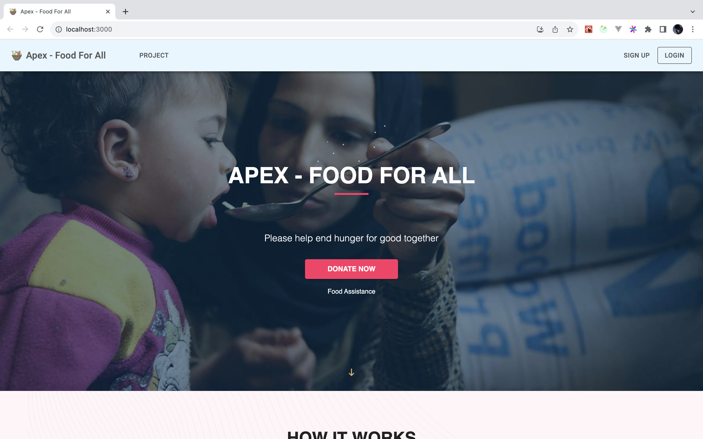
- Project List
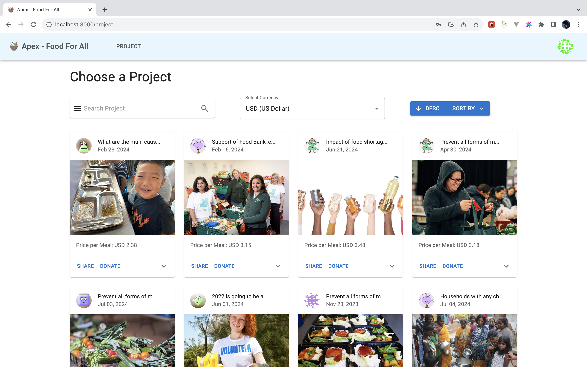
- Project Nonation
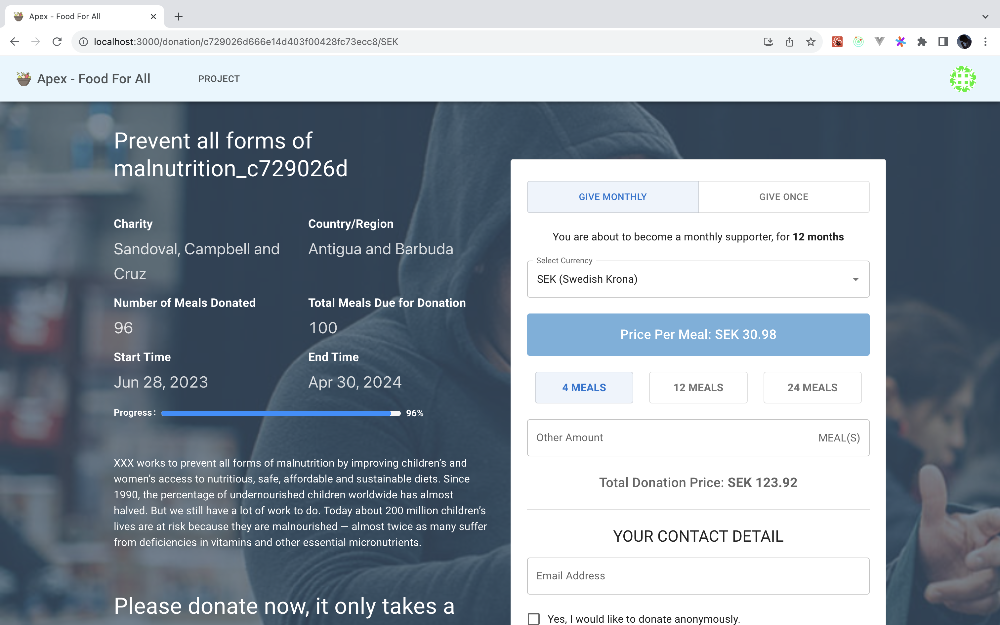

### Admin

- Charity Dashboard
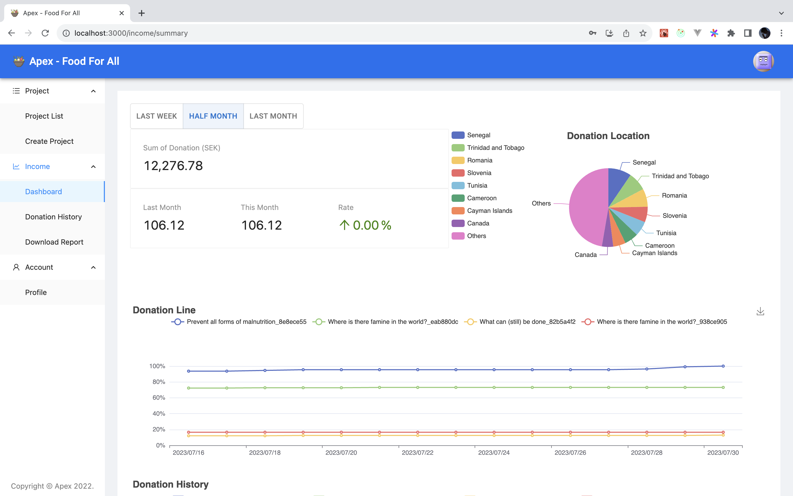
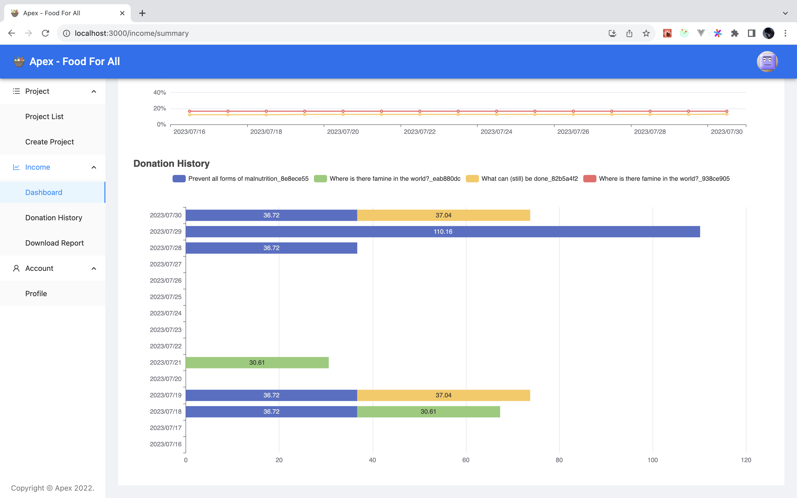
- Charity Project List
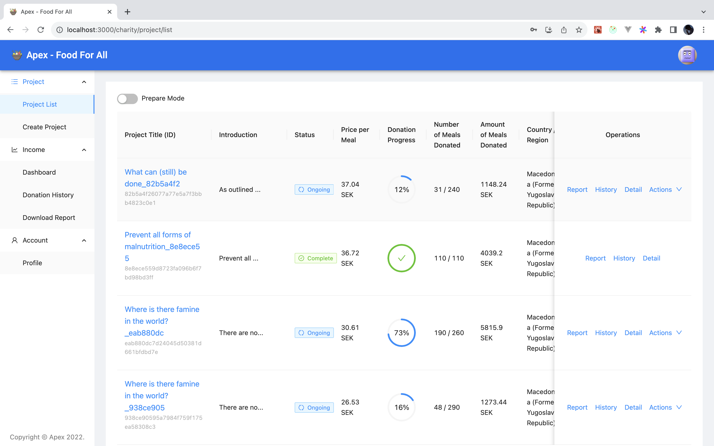
- Project Detail
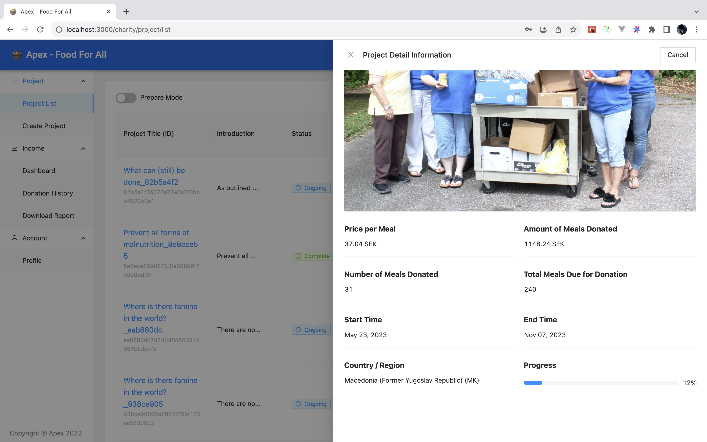
- Create Project
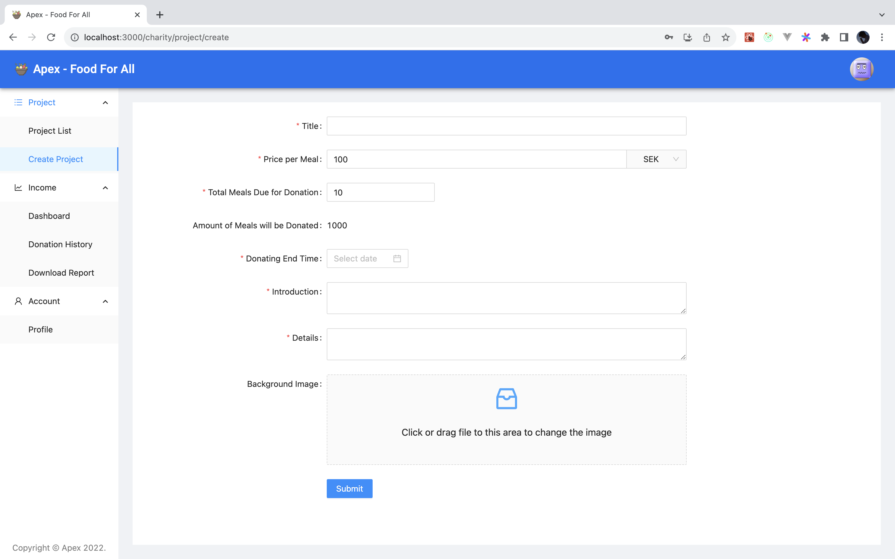
- Donation History
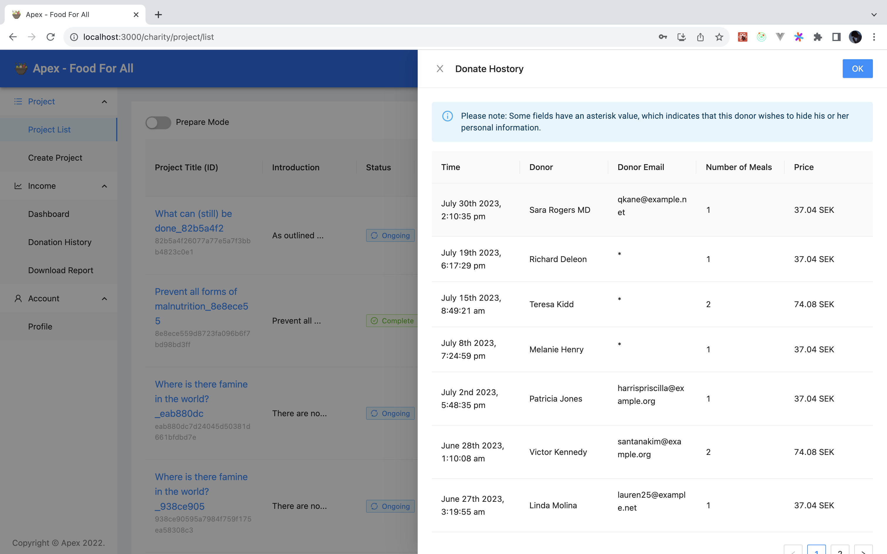

### User

- Login Page
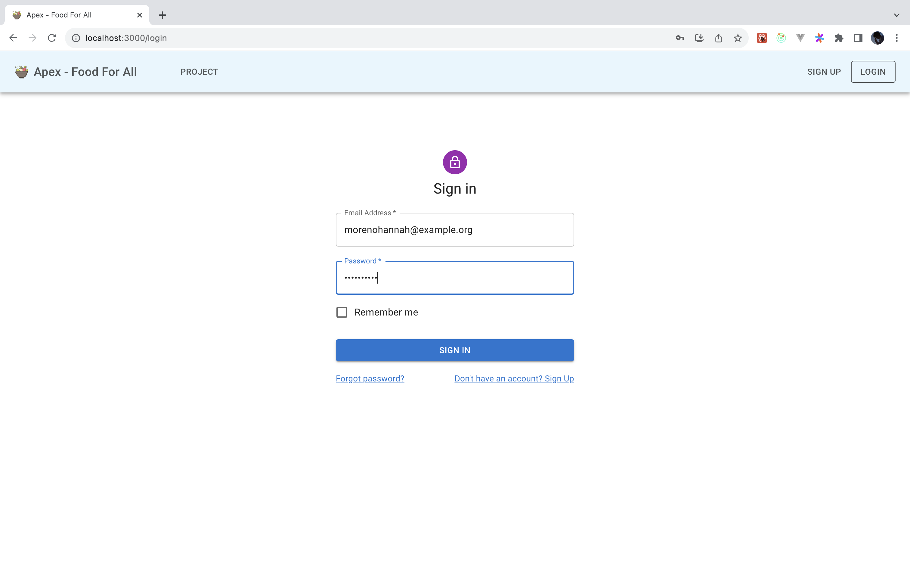
- Register Page
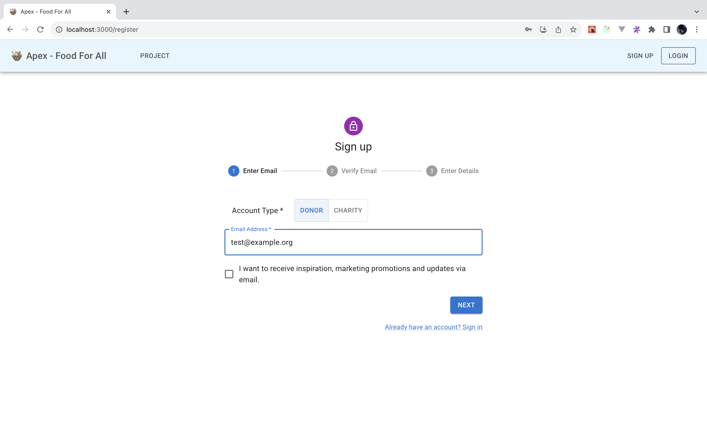

## Team division

### Front End

- **Mingze Ma** (Mostly contributor of front end)
- Tianhao Shi
- Hangting Dong

### Back end

- Tianyu Liang
- **Mingze Ma**
- Youzheng Jia
- Zhengwei Zhan

